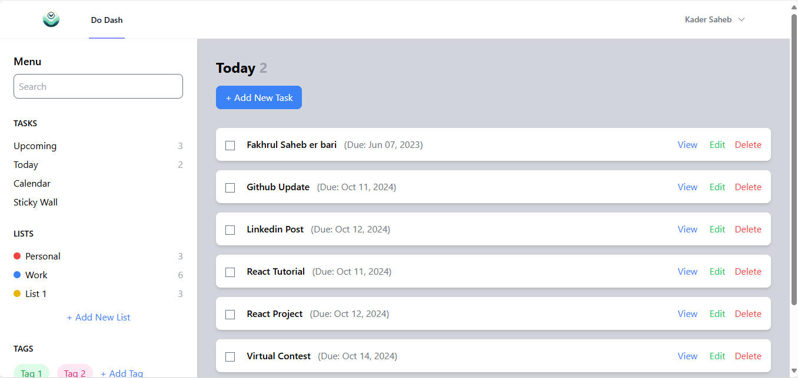
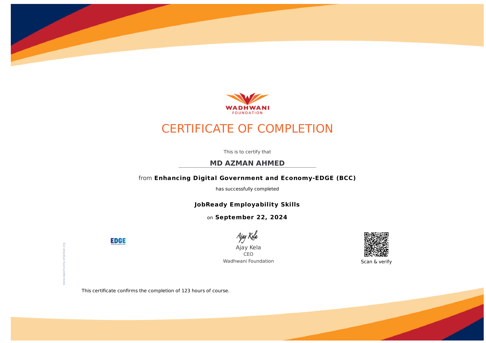
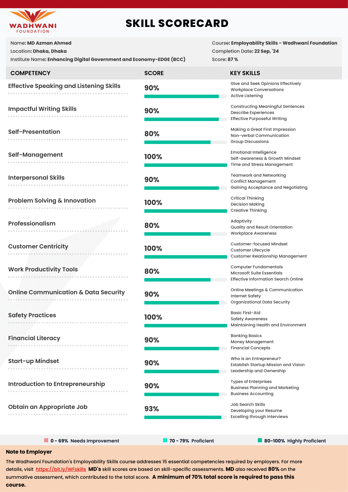

# Hi there, I'm MD. Azman Ahmed! 👋

## About Me

<!--

  

 -->
I'm a passionate developer and competitive programmer with experience in Software Engineering. I love solving challenging problems and participating in programming contests.

<!-- - 🔭 I’m currently working on [Current Project] -->
- 💼 I’m currently working as a Junior Laravel-React Developer in Soft BD ltd. 
- 🎓 graduated from East West University with a degree in CSE.
- 🌱 Interested to learn ASP .Net Core 8.0
- 👯 I’m interested to work as a Software Engineer 
- 📫 How to reach me: [ahmed.azman.bd0007@gmail.com]
- ICPC Public Profile https://icpc.global/ICPCID/SS51WE80VVKV

  
  

## 🌐 Socials:
 
 
 
 
 

## Skills

- **Languages**:  
       

- **Frameworks**:  
    

- **Databases**:  
     

- **Version Control**:  
     

<h1 align="center">Github Stats</h1>

  <table>
    <tr>
      <td>
        

          
        

      </td>
      <td>
        
      </td>
    </tr>
    <tr>
      <td colspan="2" align="center">
        

          
        

      </td>
    </tr>
  </table>

<h1 align="center">Programming Stats</h1>
    <table align="center">
        <tr>
            <td>
                

                    
                

            </td>
            <td>
                

                    
                

            </td>
        </tr>
        <tr>
            <td>
                

                  
                

            </td>
        </tr>
    </table>

## Projects

<table>
  <th>Laravel Projects</th>
  <tr>
    <td> 
      <h2><a href="https://github.com/Azman-Ahmed/DoDash" target="_blank">Do Dash: A to-do web application using Laravel 11</a></h2>
      

        
      

    </td>

  </tr>
</table>

<table>
  <th>PHP Projects</th>
  <tr>
    <td> 
      <h2><a href="https://github.com/Azman-Ahmed/T20-World-Cup-Website" target="_blank">T20 World Cup Website</a></h2>
      

        
      

    </td>

  </tr>
</table>

<table>
  <th>Research Work</th>
  <tr>
    <td> 
      <h2><a href="https://github.com/Azman-Ahmed/Stylometry-based-Author-Profiling-on-Bangla-Text-Using-Text-Clustering" target="_blank">Stylometry-Based Author Profiling on Bangla Text Using Text Clustering</a></h2>
      

        
      

      

        Utilizing stylometry features extracted from Bangla text, this project employs clustering methods to identify the classical writer most likely to have authored the given texts.
      

    </td>

  </tr>
</table>

<table>
  <th>Dot Net Project</th>
  <tr>
    <td> 
      <h2><a href="https://github.com/Azman-Ahmed/Customer-Form-using-.NET-MVC" target="_blank">Customer-Form-using-.NET-MVC</a></h2>
      

        
        
      

      
A customer form using .NET MVC core 8.0 which validates then store Customer Information and views returning customer details.

      

        Utilizing stylometry features extracted from Bangla text, this project employs clustering methods to identify the classical writer most likely to have authored the given texts.
      

    </td>

  </tr>
</table>

<!-- ### [Another Project](https://github.com/your-username/another-project)

Brief description of the project. What does it do? What technologies were used? -->

## Certifications

<table>
  <tr>
    <td>
      

        <a href="https://icpc.global/ICPCID/SS51WE80VVKV">
          
ICPC Certification

          
        </a>
      

    </td>
    <td>
      

        <a href="https://drive.google.com/file/d/1oAqygnrEOZfu4aXhunvUI38qX_xwfCu1/view?usp=drive_link">
          
UAP Inter University Programming Contest

          
        </a>
      

    </td>
    <td>
      

        <a href="https://drive.google.com/file/d/1oH-zAB2bGCcdKDj-Muo21rCC3Ym8C0YD/view?usp=drive_link">
          
English Communication Course

          
        </a>
      

    </td>
  </tr>

  <tr>
    <td>
      

        <a href="#">
          
Wadhwani - JobReady Employability Skills

          
        </a>
      

    </td>
    <td>
      

        <a href="#">
          
Wadhwani - JobReady Employability Skills

          
        </a>
      

    </td>
    
  </tr>
  
  <tr>
    <td>
      

        <a href="https://www.hackerrank.com/certificates/02cc8b77c55b">
          
HackerRank SQL Basic Certificate

          
        </a>
      

    </td>
    <td>
      

        <a href="https://www.hackerrank.com/certificates/1f36801c7dc4">
          
HackerRank Problem Solving (Basic) Skills Certification Test

          
        </a>
      

    </td>
    <td>
      

        <a href="https://www.hackerrank.com/certificates/7f523e3212ba">
          
HackerRank SQL Intermediate Certificate

          
        </a>
      

    </td>
  </tr>
</table>

## Competitive Programming

- **Profiles**:
  - 
  - 
  - 
  - 

  

## Contact

- 
- 
-  

---

  
 </a> 

