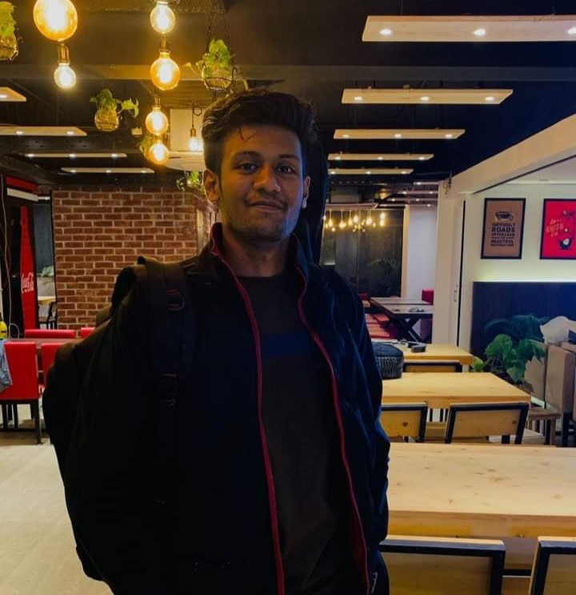
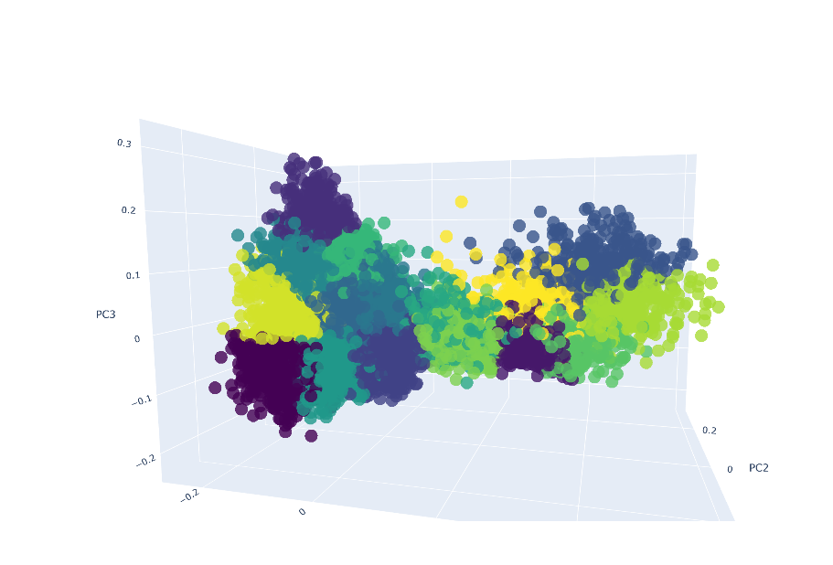
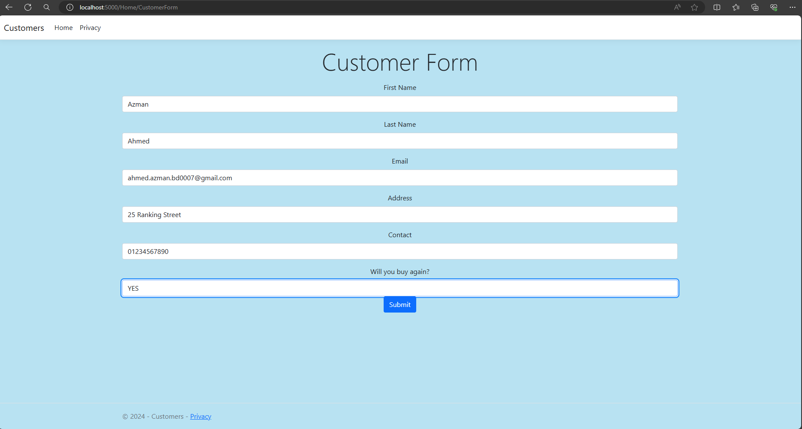
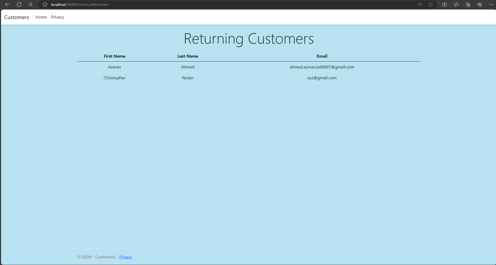
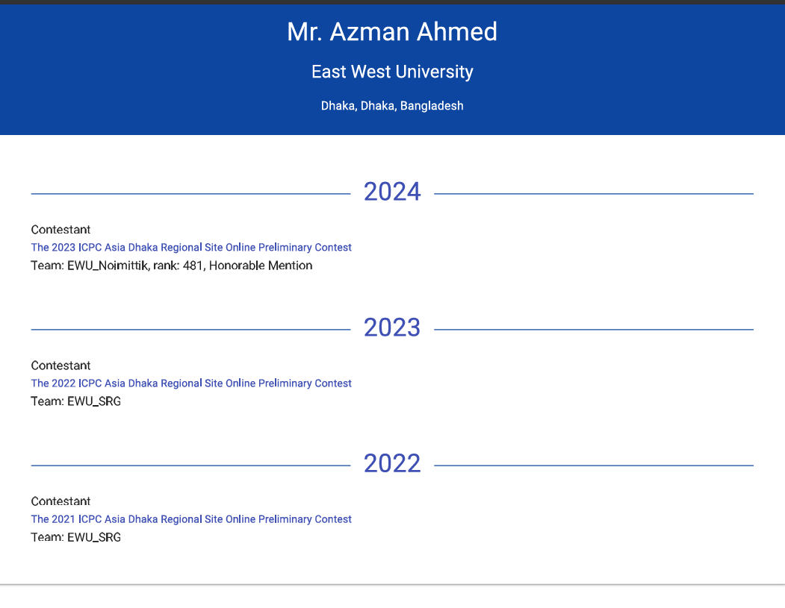
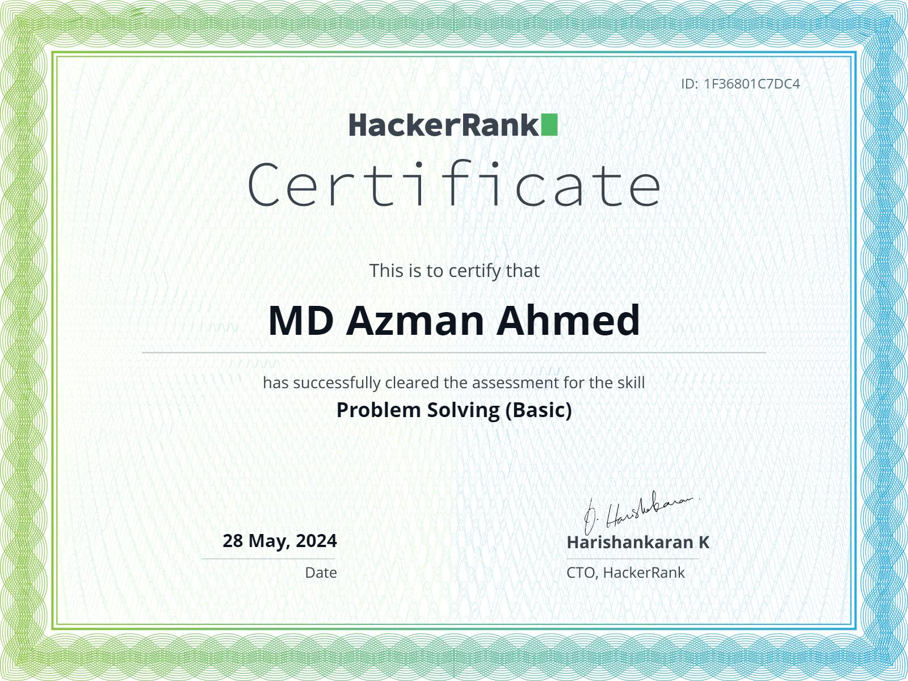
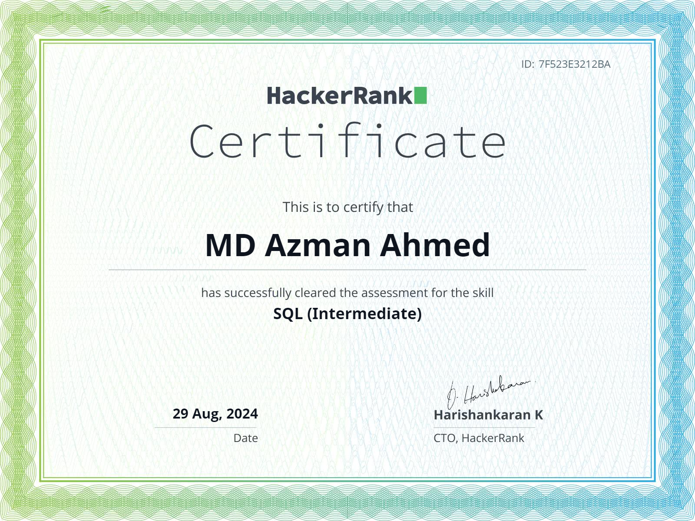

# Hi there, I'm MD. Azman Ahmed! 👋

## About Me

<!--

  

 -->
I'm a passionate developer and competitive programmer with experience in Software Engineering. I love solving challenging problems and participating in programming contests.

<!-- - 🔭 I’m currently working on [Current Project] -->
- 🎓 graduated from East West University with a degree in CSE.
- 💼 I’m currently working as a Trainee Laravel Developer in Soft BD ltd. 
- 🌱 I’m currently learning ASP .Net Core 8.0
- 👯 I’m interested to work as a Software Engineer 
- 📫 How to reach me: [ahmed.azman.bd0007@gmail.com]
- ICPC Public Profile https://icpc.global/ICPCID/SS51WE80VVKV

  
  

## Skills

- **Languages**:     
- **Frameworks**:  
- **Tools**:  

<h1 align="center">Github Stats</h1>

  <table>
    <tr>
      <td>
        

          
        

      </td>
      <td>
        
      </td>
    </tr>
    <tr>
      <td colspan="2" align="center">
        

          
        

      </td>
    </tr>
  </table>

<h1 align="center">Programming Stats</h1>
    <table align="center">
        <tr>
            <td>
                

                    
                

            </td>
            <td>
                

                    
                

            </td>
        </tr>
        <tr>
            <td>
                

                  
                

            </td>
        </tr>
    </table>

## Projects

### [Stylometry-Based Author Profiling on Bangla Text Using Text Clustering](https://github.com/Azman-Ahmed/Stylometry-based-Author-Profiling-on-Bangla-Text-Using-Text-Clustering)

  

Utilizing stylometry features extracted from Bangla text, this project employs clustering methods to identify the classical writer most likely to have authored the given texts.

### [Customer-Form-using-.NET-MVC](https://github.com/Azman-Ahmed/Customer-Form-using-.NET-MVC)

  <tr>
    <td></td>
    <td></td>
  </tr>

A customer form using .NET MVC core 8.0 which validates then store Customer Information and views returning customer details.

### [T20 World Cup Website](https://github.com/Azman-Ahmed/T20-World-Cup-Website)

  

<!-- ### [Another Project](https://github.com/your-username/another-project)

Brief description of the project. What does it do? What technologies were used? -->

## Certifications

<table>
  <tr>
    <td>
      

        <a href="https://icpc.global/ICPCID/SS51WE80VVKV">
          
ICPC Certification

          
        </a>
      

    </td>
    <td>
      

        <a href="https://drive.google.com/file/d/1oAqygnrEOZfu4aXhunvUI38qX_xwfCu1/view?usp=drive_link">
          
UAP Inter University Programming Contest

          
        </a>
      

    </td>
    <td>
      

        <a href="https://drive.google.com/file/d/1oH-zAB2bGCcdKDj-Muo21rCC3Ym8C0YD/view?usp=drive_link">
          
English Communication Course

          
        </a>
      

    </td>
  </tr>
  <tr>
    <td>
      

        <a href="https://www.hackerrank.com/certificates/02cc8b77c55b">
          
HackerRank SQL Basic Certificate

          
        </a>
      

    </td>
    <td>
      

        <a href="https://www.hackerrank.com/certificates/1f36801c7dc4">
          
HackerRank Problem Solving (Basic) Skills Certification Test

          
        </a>
      

    </td>
    <td>
      

        <a href="https://www.hackerrank.com/certificates/7f523e3212ba">
          
HackerRank SQL Intermediate Certificate

          
        </a>
      

    </td>
  </tr>
</table>

## Competitive Programming

- **Profiles**:
  - 
  - 
  - 
  - 

  

## Contact

- 
- 
-  

---

  
 </a> 

